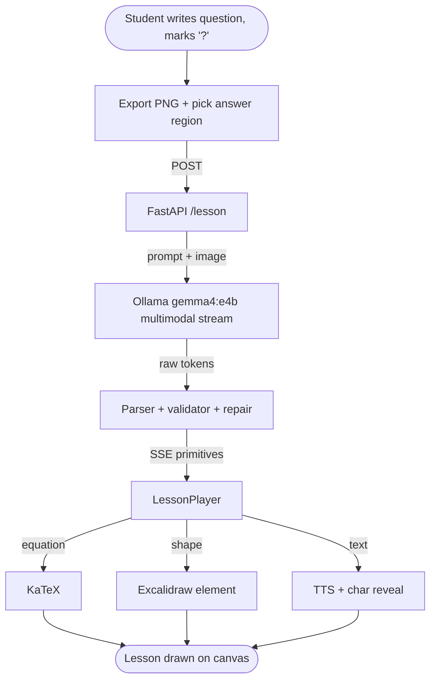

# Y - an AI Learning Companion

> Most AI tutors are chat boxes. This one writes on your whiteboard.

A pedagogical AI that reads the student's whiteboard, finds the part marked
with `?`, and explains the answer by drawing on the same canvas while
narrating aloud.

The student writes a question (`F = m * a, m=2kg, F=10N, a = ?`), clicks
**Solve**, and watches the tutor draw a clean explanation — title, narration,
equations, diagrams — in a free region of the canvas. Each character of the
on-canvas text appears in lockstep with the speech synthesizer's word-boundary
events, so the writing literally writes itself at the speed the voice is
reading it.

**Stack:** Next.js 16, React 19, FastAPI, Ollama (`gemma4:e4b`), Excalidraw,
KaTeX, Web Speech API.

## Demo

[Demo](https://github.com/user-attachments/assets/f047e52c-9d8d-4463-a7cc-f260963f3fca)

## How it works



The LLM is constrained to a vocabulary of 7 primitives
([`schema/primitives.json`](./schema/primitives.json)):

| Tag | Purpose | Example |
| --- | --- | --- |
| `title` | Lesson heading | `[title: "Newton's Second Law"]` |
| `text` | Narrated sentence (also drawn) | `[text: "Solve for a."]` |
| `equation` | KaTeX-rendered math | `[equation: "a = F / m"]` |
| `box` | Labeled rectangle | `[box: id=A label="Block"]` |
| `node` | Labeled circle | `[node: id=A label="0.6"]` |
| `arrow` | Connect two ids | `[arrow: from=A to=B label="step"]` |
| `line` | Free segment | `[line: x1=0 y1=0 x2=200 y2=0 label="v"]` |

A small deterministic renderer translates each primitive into Excalidraw
elements. The bet: a tiny structured language is easier to teach an LLM (and
easier to repair) than free-form SVG.

**How it stays robust.** The validator aliases sloppy names
(`heading→title`, `eq→equation`, `rect→box`), salvages unquoted positional
args, coerces numbers, and falls back to `[text]` narration on anything
unrepairable — so prompt drift never silently drops content. The answer
region is computed from the bounding box of the student's existing elements,
so the lesson never overlaps what they already wrote.

## Quick start

Prerequisites:

- Python 3.11 (or 3.12)
- Node 20+ (uses Next.js 16 + React 19)
- [Ollama](https://ollama.com/download/windows) running locally with `gemma4:e4b` pulled
  ```powershell
  ollama pull gemma4:e4b
  ```
- [uv](https://github.com/astral-sh/uv) for Python dependency management

```powershell
# 1. Env file
Copy-Item .env.example .env

# 2. Backend (creates .venv inside api/)
cd api
uv sync
.\.venv\Scripts\python.exe -m uvicorn main:app --reload --host 127.0.0.1 --port 8000

# 3. Frontend (separate terminal)
cd web
npm install
npm run dev
```

Open <http://localhost:3000>. Click **Sample** for a Newton's-law question, or
write your own with the pen tool and mark the unknown with `?`. Then **Solve**.

## Smoke tests

Two scripts live in [`api/scripts/`](./api/scripts):

```powershell
# From api/, with venv activated and dev server running on :8000

# Unit tests for parser + validator + repair (~1s, fully offline)
.\.venv\Scripts\python.exe scripts\test_parser.py

# Single end-to-end /lesson smoke (~20s, requires Ollama)
.\.venv\Scripts\python.exe scripts\smoke_lesson.py

# All three demo scenarios end-to-end (~90s, requires Ollama)
.\.venv\Scripts\python.exe scripts\smoke_demos.py
```

The current backend score on the three reference scenarios with `gemma4:e4b`
on an RTX 5060 8GB:

| Demo | Primitives | Time |
| --- | --- | --- |
| Newton's 2nd law | 15 | 18 s |
| Vector addition | 15 | 22 s |
| Binary search | 12 | 40 s |

## Repository layout

```
Y/
+- web/                Next.js + Excalidraw + KaTeX + html2canvas-pro
|  +- src/
|     +- app/          page.tsx, layout.tsx
|     +- components/   Whiteboard.tsx, Toolbar.tsx
|     +- lib/          api.ts, renderer.ts, lesson-player.ts, tts.ts, katex.ts, layout.ts, types.ts
+- api/                FastAPI + Ollama client + prompts
|  +- main.py          /health, /schema, /lesson endpoints
|  +- teacher.py       OllamaTeacher (multimodal stream)
|  +- parser.py        incremental tag state machine
|  +- validator.py     schema check + repair + positional-arg salvage
|  +- prompts/         system.md, primitives.md, examples/{newton,vector_sum,binary_search}.md
|  +- scripts/         smoke + parser tests
+- schema/             primitives.json - single source of truth for the tag protocol
+- .env.example
+- .gitignore
```

## Future

- Replace the deterministic renderer's `box/node/arrow` paths with the
  StarVector-style decoder so diagrams render as hand-drawn SVG.
- Expand the primitive vocabulary (graphs with axes, animations, geometric
  constructions, code blocks with syntax highlighting).
- Collect stroke-order data from live sessions to train a "draw like a human"
  decoder.
- Save / share lessons; learner-profile memory.
