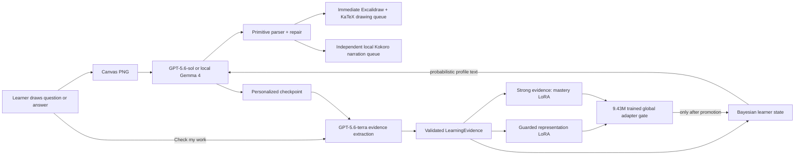

# Y v2 — a whiteboard tutor that learns the learner

Y reads a learner's Excalidraw whiteboard, teaches on the same canvas, asks a
short checkpoint, and changes the next lesson from evidence about that answer.
It is an Education-track project for OpenAI Build Week.

The central contribution is a separate 9.43M-parameter probabilistic learner
adapter. GPT-5.6 is the teacher and visual reasoner; the adapter models the
learner. Per-user rank-4 LoRA fast weights update at test time: interactions
adapt representation, while only strong independent checkpoint evidence adapts
mastery.

## What is working

- GPT-5.6 vision through the OpenAI Responses API (`gpt-5.6-sol`) streams the
  existing deterministic whiteboard primitive language.
- `Check my work` sends a checkpoint answer for lower-cost structured grading
  with `gpt-5.6-terra`.
- A causal 4-layer Transformer produces a 256-dimensional variational learner
  state and mastery distributions for arbitrary concept text.
- Every interaction runs a guarded representation-consistency update over
  Transformer LoRA; strong assessed evidence additionally updates the mastery
  decoder. The two rollback guards and counters remain independent.
- The draggable learner orb opens a live SVG concept constellation. Node size
  represents evidence, halos uncertainty, color a qualitative learning state,
  and semantic/co-occurrence edges come from the backend learner state.
- Whiteboard primitives render as soon as they stream. Kokoro narration has its
  own ordered queue, prefetches the next two segments, and never blocks drawing.
- Local Gemma 4 through Ollama remains the private/offline teacher fallback.
- Kokoro-82M narration runs locally through Moonshine Voice, with Heart and
  Michael as the only approved voices. Browser speech is a non-blocking fallback.
- Excalidraw/KaTeX remains the reliable hand for this milestone. Native SVG
  generation and DINO/structural SVG evaluation are explicitly deferred.

## System architecture



The adapter is not attached to the drawing LLM. It supplies a short,
deterministic profile such as likely-understood concepts, uncertain concepts,
supported misconceptions, and recommended depth. Numeric mastery values are
not revealed to the learner or teacher model.

## Quick start

Prerequisites: Python 3.11, Node 20+, [uv](https://docs.astral.sh/uv/), and
optionally [Ollama](https://ollama.com/) for local mode.

```bat
copy .env.example .env
cd api
uv sync
cd ..\web
npm install --legacy-peer-deps
```

Put `OPENAI_API_KEY` in `.env` for the submission path. With a key present,
the UI selects GPT-5.6 by default and visibly labels that the canvas is sent to
OpenAI. Raw learner ids are never sent; the backend uses a salted SHA-256
`safety_identifier`.

For the local fallback:

```bat
ollama pull gemma4:e4b
ollama pull nomic-embed-text
```

Start the two processes:

```bat
REM terminal 1
cd api
.\.venv\Scripts\python.exe -m uvicorn main:app --host 0.0.0.0 --port 8000 --reload

REM terminal 2
cd web
npm run dev
```

Open `http://localhost:3000/app`.

## Local Kokoro speech

Speech is an optional dependency so the core app remains installable on hosts
without a compatible Moonshine wheel:

```bat
cd api
uv sync --extra speech
.\.venv\Scripts\python.exe scripts\prefetch_speech.py
```

The prefetch command downloads only English G2P, the Kokoro ONNX model, and
`kokoro_af_heart` / `kokoro_am_michael`; it audits forbidden asset names and
writes `api/speech_assets.lock.json` with exact hashes. Set
`SPEECH_REQUIRE_LOCK=1` for a release. Stop aborts both an in-flight `/speech`
request and active audio. Changing Heart/Michael invalidates old prefetches and
resumes at the current word; drawing continues independently.

Moonshine is pinned to `0.0.69`. The runtime/G2P is MIT licensed and the
Kokoro weights are Apache-2.0. See [THIRD_PARTY_NOTICES.md](./THIRD_PARTY_NOTICES.md)
and [sbom.spdx.json](./sbom.spdx.json). No Piper, voice-cloning, eSpeak, or GPL
phonemizer asset is shipped.

## Demo flow

1. Insert a math sample and press **Solve**. This is a help request: it updates
   representation/activity but never fabricates mastery evidence.
2. Read the checkpoint card, write an answer on the canvas, and press
   **Check my work**.
3. Show an incorrect but legible answer. The concept belief should fall or
   remain uncertain; the next explanation becomes more concrete.
4. Answer independently and correctly. Mastery should rise, uncertainty should
   narrow, and the next checkpoint should become a transfer question.
5. Switch to a science question. Science remains uncertain instead of
   inheriting math mastery.
6. Switch the model picker to local Gemma to show the privacy fallback.

## API contracts

| Route | Purpose |
| --- | --- |
| `GET /health` | provider, adapter checkpoint/device, and speech readiness |
| `POST /lesson` | PNG + user/conversation/model; streams primitives, learner state, checkpoint |
| `POST /assess` | PNG + checkpoint; streams evidence, feedback, updated state, next checkpoint |
| `GET /learner/{user_id}` | schema v2 profile, beliefs, trajectory, steps, rollbacks, legacy sessions |
| `DELETE /learner/{user_id}` | reset v2 profile and per-user fast weights |
| `GET /speech/voices` | two allowlisted Kokoro voices |
| `POST /speech` | cached WAV synthesis, maximum 500 characters |

`LearnerState.revision` is monotonic. The frontend applies streamed state
directly and rejects older SSE or GET snapshots. The response also includes
concept relations, last activity, evidence deltas, and separate representation
and mastery adapter counters.

Learner data lives under `data/learners/<safe-user-id>/`. Profile JSON and
safetensors fast weights are replaced atomically. Reset deletes the fast
weights and writes an explicit empty v2 profile. A legacy
`data/learners/<user>.json` is migrated into low-strength evidence and retained.

## Training the global adapter

The corpus uses item content from GSM8K (MIT) and OpenBookQA (Apache-2.0).
GPT-5.6-terra labels concepts, difficulty, prerequisites, and two plausible
misconceptions. Learner histories are then simulated with known mastery,
difficulty, slip, guess, learning, and forgetting values; no real student data
or manual latent-state annotation is required.

```bat
REM Offline format smoke test
api\.venv\Scripts\python.exe training\build_learner_corpus.py ^
  --offline-smoke --learners 12 --turns 8

REM Real corpus (requires datasets + OPENAI_API_KEY)
cd api
uv sync --extra training
cd ..
api\.venv\Scripts\python.exe training\build_learner_corpus.py ^
  --learners 4000 --turns 48 --labeler openai

REM Global adapter training
api\.venv\Scripts\python.exe training\train_learner_adapter.py ^
  --epochs 30 --batch-size 64
```

The split is by learner, with a complete held-out concept cluster and science
domain slice. Training uses mixed precision on CUDA, sequences up to 64,
gradient clipping, early stopping on validation prequential log loss, and
checkpoint/config/data-manifest hashes. Release training and evaluation use
frozen `nomic-ai/nomic-embed-text-v1.5` embeddings; `--embedder hash` exists
only for an offline pipeline smoke test.

Modal is the recommended training path:

```bat
modal secret create y-openai OPENAI_API_KEY=sk-...
modal run deploy/modal_train_learner.py --learners 4000 --turns 48 --labeler openai
```

Modal first writes a candidate checkpoint, evaluates both adaptation speeds,
and only promotes it to `learner-adapter-v1.safetensors` when held-out log loss,
calibration, and rollback gates pass. Until a promoted checkpoint is present,
the application uses the honest Bayesian state, `/health` reports
`trained_checkpoint: false`, and the UI labels neural adaptation
`untrained-base`.

## Evaluation

```bat
api\.venv\Scripts\python.exe training\evaluate_learner.py ^
  --checkpoint models\learner-adapter-v1.safetensors ^
  --max-learners 500 --output training\evaluation.json
```

The harness compares the legacy heuristic, Bayesian Knowledge Tracing,
hash-query DKT/LSTM, frozen adapter, deterministic/no-uncertainty adapter, and
full Level-2 adapter. It reports next-response AUROC, log loss, Brier score,
10-bin calibration error, hidden-state Spearman correlation, adaptation gain,
cold-start loss, held-out concept/domain performance, and rollback rate.

The shipping gate is explicit: the trained full adapter must beat its frozen
ablation on held-out prequential log loss and visibly change the controlled
three-turn lesson. A smoke checkpoint is not evidence for that claim.

## Verification

```bat
cd api
.\.venv\Scripts\python.exe -m pytest -q tests scripts/test_teacher.py
.\.venv\Scripts\python.exe scripts\test_parser.py
.\.venv\Scripts\python.exe scripts\test_salvage.py
.\.venv\Scripts\python.exe scripts\benchmark_adapter.py

cd ..\web
npm test
npm run lint
npx tsc --noEmit
npm run build
npm audit --omit=dev
```

The tests cover revision ordering, direct SSE application, concept relations,
representation/mastery isolation, independent rollback, the untrained gate,
persistence/migration, constellation layout, orb drag/persistence, narration
ordering and voice invalidation, speech caching, and malformed teacher JSON.

## Repository map

```text
api/learner_adapter.py        9.43M global model + functional rank-4 LoRA
api/learner.py                evidence validation, state, adaptation, persistence
api/teacher.py                GPT-5.6 Responses API + Gemma providers
api/speech.py                 Moonshine/Kokoro service, cache, asset audit
api/main.py                   lesson, assess, learner, speech, health contracts
web/src/app/app/page.tsx      whiteboard lesson/assessment orchestration
training/                     corpus, global training, prequential evaluation
deploy/modal_train_learner.py Modal A10G training job
docs/architecture.md          detailed data and event flow
docs/codex-decision-log.md    implementation choices and Codex contribution
```

## Privacy and scope

Cloud mode sends the current canvas to OpenAI and is clearly labeled. Local
Gemma mode keeps canvas interpretation local. Learner profiles and LoRA weights
stay on the backend filesystem in both modes. Evidence is concept-specific and
probabilistic; the system does not infer personality, intelligence, or fixed
ability axes.

Y is an educational prototype, not an authoritative grader. Handwriting and
model judgments can be wrong, which is why uncertain evidence is retained as
history but cannot adapt fast weights.
