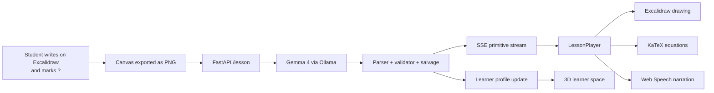

# Y · an AI learning companion that writes on your whiteboard

> Most AI tutors are chat boxes.  
> Y reads the board, reasons about the student's question, and writes the next step back on the same canvas.

Y is a local-first whiteboard tutor built with Gemma 4. A student writes a question, equation, or sketch directly on an Excalidraw canvas and marks the unknown with `?`. Y exports that canvas as an image, asks Gemma to understand the student's intent, then streams a structured lesson back to the board as titles, captions, equations, arrows, boxes, and diagrams while the browser narrates the explanation aloud.

The goal is not to generate a static answer image. The goal is to make AI feel like a patient teacher at a board: read what the learner drew, choose the next useful representation, write it step by step, and remember what the learner has seen before.

## What We Built

Y has three parts:

* **The eye and brain:** Gemma 4 through Ollama reads the whiteboard PNG and plans the explanation.
* **The hand:** a deterministic renderer turns Gemma's primitive tags into Excalidraw elements, KaTeX equations, and browser speech.
* **The learner memory:** a local profile tracks concepts seen, mastered, and struggled with, then visualizes the learner's path through a 3D latent space.

This makes the app local-first by default. The core demo runs on `gemma4:e4b` locally through Ollama, with `nomic-embed-text` for learner embeddings. A cloud teacher path and fine-tuned model slot are present, but the submission is designed so a student can learn without sending their whiteboard or learning profile to a hosted API.

## Why It Matters

Education is still mostly built around text, lectures, and one-size-fits-all explanations. But many learners think visually. They draw triangles, forces, molecules, trees, circuits, and half-finished equations when they are stuck.

Y treats the canvas as the interface. A learner does not need to translate confusion into a polished prompt. They can write naturally, mark the missing piece, and watch the system respond in the same medium: a whiteboard explanation with equations and diagrams appearing in sequence.

The long-term vision is an AI learning companion that builds an abstract map of what each learner understands and uses that map to choose the right words, diagrams, pace, and next question. This hackathon build is the first working slice of that idea.

## Core Features

* **Whiteboard-native input:** students write or draw on Excalidraw, not a chat box.
* **Gemma 4 multimodal reasoning:** the backend sends the canvas snapshot to a local Gemma model.
* **Structured drawing protocol:** Gemma emits a small primitive language: `title`, `text`, `equation`, `box`, `node`, `arrow`, and `line`.
* **Sequential playback:** the frontend draws each primitive in order and reveals text character by character.
* **Math rendering:** equations are rendered with KaTeX and embedded back into Excalidraw.
* **Text-to-speech narration:** the Web Speech API narrates while the board fills in.
* **Robust parser and repair layer:** malformed tags, bare headers, JSON-ish vision output, and equation-like text are salvaged into drawable primitives.
* **Learner profile:** each lesson updates a local JSON memory of concepts, mastery, struggle signals, summaries, and embeddings.
* **Latent learner space:** the learner panel visualizes a 3D trajectory plus interpretable axes such as diagrammatic understanding, critical reasoning, creative transfer, algebraic fluency, and conceptual depth.
* **Educator mode:** an optional second Gemma pass surfaces misconceptions, prerequisites, follow-up questions, and difficulty.

## How It Works



The key design choice is the primitive protocol. Instead of asking a small model to output arbitrary SVG perfectly, Y asks it to emit a compact sequence of whiteboard actions:

| Primitive | Purpose | Example |
| --- | --- | --- |
| `title` | lesson heading | `[title: "Newton's Second Law"]` |
| `text` | narrated caption | `[text: "Solve for acceleration."]` |
| `equation` | KaTeX-rendered math | `[equation: "a = F / m"]` |
| `box` | labelled rectangle | `[box: id=A label="start"]` |
| `node` | labelled circle | `[node: id=N label="A"]` |
| `arrow` | relationship between ids | `[arrow: from=A to=B label="next"]` |
| `line` | free vector or segment | `[line: x1=0 y1=0 x2=200 y2=0 label="v"]` |

The renderer owns layout and drawing. The model owns reasoning and pedagogy. This separation keeps the demo fast, cheap, and recoverable when the model drifts.

## Robustness

Small multimodal models are not perfectly obedient, so the backend is intentionally forgiving:

* `heading`, `h1`, `formula`, and `eq` are aliased to canonical primitives.
* Unquoted positional arguments such as `[equation: F=ma]` are repaired.
* Bare outputs like `[Title] Newton's Law` are converted into primitives.
* `[text: "a = F / m"]` is auto-promoted to an `equation`.
* If Gemma falls into OCR/JSON mode, `salvage.py` extracts the useful `text_content` and synthesizes a lesson from it.

The result is that prompt drift produces a rough lesson, not a blank board.

## Local Quick Start

Prerequisites: Python 3.11+, Node 20+, [Ollama](https://ollama.com/download), and [uv](https://github.com/astral-sh/uv).

```cmd
cd /d "C:\path\to\Y"
copy .env.example .env
ollama pull gemma4:e4b
ollama pull nomic-embed-text
```

Start the backend:

```cmd
cd /d "C:\path\to\Y"
cd api
uv sync
.venv\Scripts\python.exe -m uvicorn main:app --host 0.0.0.0 --port 8000 --reload
```

Start the frontend in another terminal:

```cmd
cd /d "C:\path\to\Y\web"
npm install --legacy-peer-deps
npm run dev
```

Open `http://localhost:3000/app`, insert a sample or write your own question, mark the unknown with `?`, and press **Solve**.

## Tests

```cmd
cd /d "C:\path\to\Y"
api\.venv\Scripts\python.exe api\scripts\test_parser.py
api\.venv\Scripts\python.exe api\scripts\test_salvage.py
api\.venv\Scripts\python.exe api\scripts\smoke_lesson.py
```

`test_parser.py` covers the parser, validator, repair logic, SVG sanitizer hooks, and equation auto-promotion. `test_salvage.py` covers fallback extraction from JSON/OCR-style model outputs. `smoke_lesson.py` runs the full local `/lesson` pipeline against Ollama.

## Fine-Tuning Path

The repo includes an Unsloth training notebook at [`training/unsloth-training.ipynb`](./training/unsloth-training.ipynb) and a dataset preparation script at [`training/prepare_dataset.py`](./training/prepare_dataset.py). This work explores the next phase: teaching Gemma to emit more SVG-like drawing actions directly from sketch datasets.

Two LoRA artifacts were produced during development:

* [`QuantumTransformer/y-gemma4-svg-lora`](https://huggingface.co/QuantumTransformer/y-gemma4-svg-lora)
* [`QuantumTransformer/y-gemma4-svg-lora-enhanced`](https://huggingface.co/QuantumTransformer/y-gemma4-svg-lora-enhanced)

The hackathon demo uses the robust primitive renderer as the reliable path, while the LoRA represents the research direction toward a more SVG-native teacher.

## Repository Layout

```text
Y/
├── api/                      FastAPI, Gemma/Ollama teacher, parser, learner memory
│   ├── main.py               /health, /schema, /lesson, /learner
│   ├── teacher.py            local Ollama + optional cloud teacher
│   ├── parser.py             incremental primitive parser
│   ├── validator.py          repair, aliases, equation promotion, SVG safety hooks
│   ├── salvage.py            fallback from OCR/JSON/plain text to primitives
│   └── prompts/              compact 7-primitive prompt and few-shot examples
├── web/                      Next.js, Excalidraw, KaTeX, TTS, learner panel
├── schema/primitives.json    primitive schema used by parser and renderer
├── training/                 dataset preparation and Unsloth notebook
├── models/                   Ollama Modelfile for the fine-tuned slot
├── docs/                     architecture, Kaggle writeup, submission notes
└── assets/                   local demo videos
```

## Limitations

Y is a prototype. It can misread handwriting, solve incorrectly, or produce a rough layout. The default model is small enough to run locally, so the system trades maximum reasoning quality for privacy, cost, and latency. The current primitive protocol is strong for equations, flowcharts, graph-like diagrams, and simple whiteboard explanations; richer chemistry/anatomy/freeform SVG drawing is the next research step.

## Ethics

Y is designed around local inference and local memory. Learner profiles are JSON files on disk. The cloud path is optional. For a tool aimed at children, privacy and cost control are not nice-to-haves; they are core product requirements.
