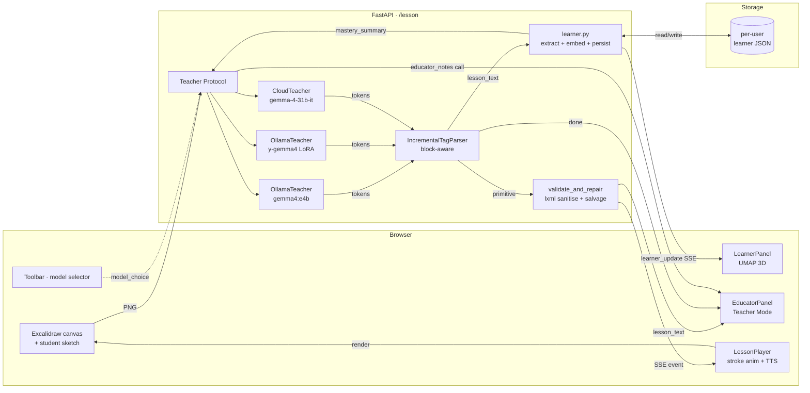
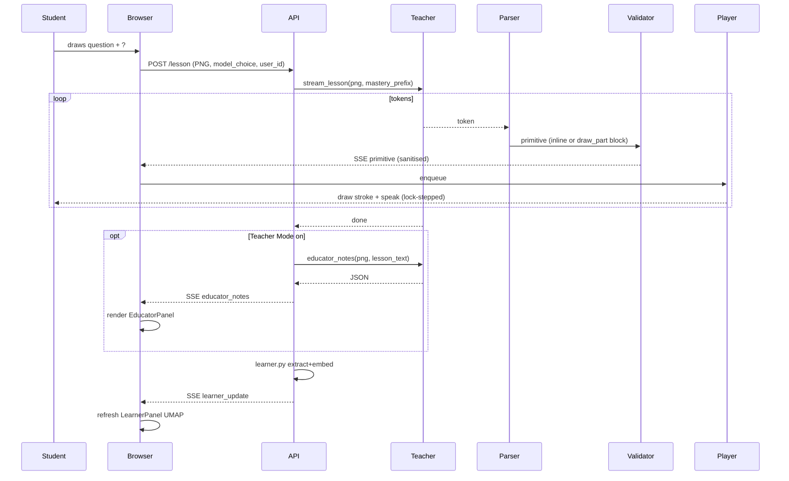

# Architecture

## High-level



## Lesson stream lifecycle



## File layout (textual)

```
Y/
├─ web/src/                   Next.js 16 / React 19 / Excalidraw
│  ├─ app/page.tsx            orchestrator: state, runLesson, modelChoice
│  ├─ components/
│  │  ├─ Whiteboard.tsx       Excalidraw wrapper + appendElements helper
│  │  ├─ Toolbar.tsx          model picker, Solve, Replay, Stop, samples
│  │  ├─ EducatorPanel.tsx    teacher-mode notes, bottom-right
│  │  └─ LearnerPanel.tsx     3D UMAP knowledge map, bottom-left
│  └─ lib/
│     ├─ api.ts               streamLesson SSE client + fetchHealth/Learner
│     ├─ renderer.ts          primitive → Excalidraw element
│     ├─ rough-svg.ts         hand-drawn pass on raw SVG
│     ├─ lesson-player.ts     queue + TTS sync + playDrawPart anim
│     ├─ katex.ts             [equation] → SVG
│     ├─ tts.ts               Web Speech API wrapper
│     ├─ layout.ts            studentBbox + answerRegion math
│     └─ types.ts             primitive + lesson event types
├─ api/                       FastAPI + Ollama + Cloud teacher
│  ├─ main.py                 /health · /schema · /lesson · /learner
│  ├─ teacher.py              Teacher protocol · OllamaTeacher · CloudTeacher · MODEL_REGISTRY
│  ├─ parser.py               incremental tag state machine (block-aware)
│  ├─ validator.py            schema check · SVG sanitise · per-path salvage
│  ├─ learner.py              concept extraction · nomic embed · JSON store
│  ├─ prompts/
│  │  ├─ system.md            multi-tool agent prompt
│  │  ├─ primitives.md        tag-by-tag reference
│  │  └─ examples/            pythagoras / freebody / benzene / cell / dfs_tree
│  └─ scripts/                test_parser.py · test_teacher.py · smoke_demos.py
├─ schema/primitives.json     single source of truth
├─ training/
│  ├─ prepare_dataset.py      ControlSketch-Part → instruction JSONL
│  ├─ _build_notebook.py      generator
│  └─ unsloth_train.ipynb     QLoRA on gemma-4-E2B-it
├─ models/
│  ├─ Modelfile.y-gemma4      Ollama wrapper for the fine-tuned GGUF
│  └─ README.md
├─ deploy/
│  ├─ modal_app.py            serverless API on Modal (cloud-only)
│  └─ README.md
└─ docs/
   ├─ kaggle_writeup.md       judge-facing pitch
   ├─ architecture.md         this file
   └─ video_script.md         3-minute video shoot script
```

## Why this layout

* **Schema as a contract.** `schema/primitives.json` is loaded by both
  the validator (Python) and the renderer (TypeScript). Adding a new
  primitive means editing one file and getting both sides in sync.
* **Teacher protocol.** `Teacher` is a `typing.Protocol` so the
  registry can switch between local and cloud without the rest of the
  API knowing or caring.
* **Streaming all the way down.** Tokens, primitives, educator notes,
  learner updates — every event is an SSE frame. The frontend never
  does request-response polling.
* **One source of truth per concern.** Prompts live with the API
  (because they're tied to the model). Demo samples live with the
  frontend (because they're tied to UI). Dataset prep lives in
  `training/` (because it produces an artifact the model consumes).
