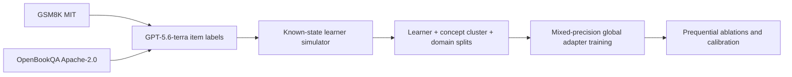

# Y v2 architecture

## Boundaries

Y deliberately separates three models:

1. The teacher/drawing model reads the canvas, plans pedagogy, and emits the
   existing primitive protocol. This is GPT-5.6-sol in cloud mode or Gemma 4
   locally.
2. GPT-5.6-terra is the evidence observer. It grades a checkpoint into a
   validated probability distribution and confidence fields.
3. The learner adapter models the learner. Its global parameters are shared;
   rank-4 LoRA fast weights are private to one user. Teacher parameters are
   never updated per user.

## Lesson and assessment sequence

```mermaid
sequenceDiagram
    participant L as Learner
    participant W as Whiteboard UI
    participant T as Teacher LLM
    participant A as Learner adapter
    participant S as Kokoro speech

    L->>W: Draw question + ?
    W->>T: POST /lesson (PNG, conversation, hashed safety id)
    T-->>W: SSE primitive stream
    T-->>W: personalized checkpoint
    W->>S: POST /speech per caption
    S-->>W: WAV; reveal follows playback time
    Note over A: Help request becomes weak history only
    L->>W: Draw checkpoint answer
    W->>T: POST /assess
    T-->>A: validated LearningEvidence
    alt strong checkpoint evidence
        A->>A: three fast-weight steps + replay guard
    else ambiguous or helped
        A->>A: history only
    end
    A-->>T: deterministic probabilistic profile
    T-->>W: corrective primitives + next checkpoint
```

## Learner adapter

Default configuration:

| Component | Shape |
| --- | --- |
| Event embedding | frozen `nomic-embed-text`, 768 |
| Numeric evidence | 8 values |
| Event projection | 776 to 512 |
| Causal encoder | 4 blocks, width 512, 8 heads, FFN 1024 |
| Posterior | 256-dimensional mean and log variance |
| Concept query | arbitrary concept text, 768 to 256 |
| Decoder | concatenated latent/query to 256 to probability |
| Global parameters | 9,433,857 |
| Fast parameters | rank-4 LoRA in blocks 3–4 and decoder |

The event stream is causal. For an arbitrary concept query, 16 posterior
samples produce mastery mean and uncertainty. The UI reports a 95% interval
and evidence context, never a categorical declaration of ability.

### Online update guard

A checkpoint can adapt only when `evidence_strength >= 0.65`. The batch is the
latest eight strong events plus up to eight replay events. It uses soft
correctness (`P(correct) + 0.5 P(partial)`), confidence and independence
weights, AdamW, three steps, gradient norm 1, and L2 anchoring. Replay loss is
measured before and after; more than 5% degradation restores a cloned fast
checkpoint and increments `rollback_count`.

## Durable state

```text
data/learners/<safe-id>/
  profile.json                 schema, legacy sessions, evidence, states, checkpoints
  fast_weights.safetensors     only this learner's LoRA A/B tensors
```

Both files use temporary-file plus `os.replace` writes. Loading validates
tensor names/shapes against the global adapter. Reset removes fast weights and
replaces the v2 state with an empty profile; an original legacy
`<safe-id>.json` remains preserved but is not re-migrated.

## Teacher providers

`teacher.Teacher` is the provider boundary. All implementations support lesson
streaming, evidence extraction, checkpoint generation, and assessment feedback.

- `OpenAITeacher`: Responses API, base64 PNG `input_image`, streamed output
  text deltas, medium reasoning for teaching and low reasoning for evidence.
- `OllamaTeacher`: local Gemma 4 path; keeps the primitive/parser contract.
- `CloudTeacher`: retained Google AI Studio compatibility path.

The model registry prefers OpenAI when `OPENAI_API_KEY` is configured; otherwise
the UI remains on `gemma4:e4b`. The toolbar does not hide the privacy boundary.

## SSE ordering

`POST /lesson`:

```text
token/primitive* -> educator_notes? -> learner_update -> learner_state -> checkpoint -> done
```

`POST /assess`:

```text
evidence -> token/primitive* -> learner_state -> checkpoint -> done
```

Every stream may terminate with `error`. Frontend contracts are mirrored in
`web/src/lib/types.ts`.

## Speech boundary

`api/speech.py` exposes only two identifiers. Moonshine's asset downloader is
called only through an allowlisted Kokoro id. `prefetch_speech.py` loads both,
rejects paths containing Piper, ZipVoice, or eSpeak, and writes hashes. WAV
responses are cached by normalized text, voice, speed, and model version.

## Research data flow



ASSISTments is not part of this pipeline. It is optional research-only input
under separate terms and must never be redistributed with the checkpoint.

## Deferred SVG phase

The primitive renderer is unchanged for v2. The next paper phase can add native
SVG generation and report DINO similarity, SVG structural validity, OCR/math
equivalence, and graph-edit distance without confounding the learner-adaptation
study.
