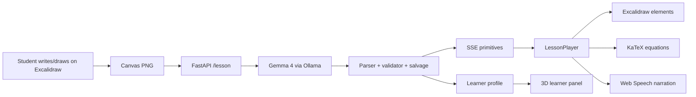

# Y: an AI learning companion that writes on your whiteboard

## Project Description

A learner usually does not get stuck at the end of a problem.

They get stuck in the middle.

A child writes half an equation and stops. A student draws a triangle, circles one angle, and does not know what to do next. Someone learning physics sketches a block, adds a few arrows, then realizes the idea no longer makes sense.

In that moment, they are not asking for a polished answer.

They are asking:

> Can someone look at what I am thinking and help me from here?

That is the moment Y is built for.

Y is a local-first AI learning companion that turns a whiteboard into the conversation. Instead of forcing students to type perfect prompts into a chat box, Y lets them learn the way they naturally think: by writing, drawing, circling, pointing, and marking confusion with a simple `?`.

A learner opens an Excalidraw canvas, sketches a problem, and marks the place they are stuck. Y reads the board using a Gemma-powered local model through Ollama, understands the learner's intent, and writes the explanation back on the same canvas.

But Y does not simply return a paragraph.

It teaches on the board.

A title appears. Captions are written step by step. Equations render as clean math. Arrows connect ideas. Boxes highlight important parts. Diagrams form gradually while the browser narrates the explanation aloud.

The experience feels less like asking an AI for an answer and more like having a teacher sit beside you, look at your work, and help you understand the next step.

This hackathon build is the first working slice of that vision: a Gemma-powered whiteboard tutor with local inference through Ollama, sequential drawing, robust primitive rendering, educator notes, Unsloth fine-tuning experiments, and a 3D learner-knowledge visualization.

The long-term vision is an AI companion that grows with the learner. Not just a model that answers today's question, but a system that understands what the learner already knows, where they struggle, and which explanation will help next: words, equations, diagrams, flowcharts, or hand-drawn visual structure.

Y is local-first by design. The whiteboard image can be processed through a local model. The learner profile lives as a JSON file on the device. The embedding model is local. Cloud inference is optional, not required.

## Why this matters

The education gap is urgent. The [World Bank reports](https://www.worldbank.org/en/news/press-release/2022/06/23/70-of-10-year-olds-now-in-learning-poverty-unable-to-read-and-understand-a-simple-text) that 70% of 10-year-olds in low- and middle-income countries cannot read and understand a simple text. The [World Economic Forum](https://www.weforum.org/publications/the-future-of-jobs-report-2023/in-full/4-skills-outlook/) expects 44% of workers' skills to be disrupted within five years.

Behind those numbers are real learners who cannot afford to wait.

A child who misses fractions today may struggle with algebra tomorrow. A student who never understands forces may carry that confusion through all of physics. A worker whose job changes because of AI may need to relearn quickly, visually, and independently.

The world is accelerating. Learning cannot remain trapped inside a chat box.

Most AI tutors still expect students to ask clean, complete questions. But real learning is messy. Students cross things out. They draw arrows. They make mistakes. They know where they are confused, even when they cannot explain it in words.

Y starts from a simple belief:

> The canvas should be the conversation.

For a global education tool, this matters. A student's access to a personal tutor should not depend on expensive APIs, perfect internet, or sending every learning moment to the cloud. Cost, privacy, and connectivity should not decide who gets help.

Y is not trying to replace teachers.

It is trying to preserve the most human part of teaching: seeing where a learner is stuck, meeting them at that exact point, and helping the idea finally make sense.

Because in an AI-shaped world, the people who fall behind may not be the ones who lack intelligence.

They may be the ones who never got the right explanation at the right moment.

Y exists to make that moment easier to reach.

## What we built

### 1. Local-first Gemma + Ollama tutor

The core demo runs locally. The whiteboard image is sent to `gemma4:e4b` through Ollama, the learner profile is stored as JSON on disk, and embeddings are computed with `nomic-embed-text`. A cloud model path exists, but it is optional. The product thesis is that a learning companion for children should be private, cheap, and usable without creating an API bill.

The frontend is built on Excalidraw. The student can use drawing tools directly, insert sample problems, or write a custom question. When they press **Solve**, the app exports the canvas as a PNG and sends it to the local FastAPI backend. The backend asks Gemma 4 to read the board and produce a teaching plan as a stream of primitive tags. The frontend consumes those tags over Server-Sent Events and draws them back onto the same canvas.

The important design constraint is sequentiality. Y does not paste a final answer. It teaches step by step.

### 2. A compact whiteboard action language

Instead of asking a small model to output arbitrary SVG perfectly, the demo uses a compact primitive protocol:

| Primitive  | Role                                  |
| ---------- | ------------------------------------- |
| `title`    | lesson heading                        |
| `text`     | narrated caption written on the board |
| `equation` | KaTeX-rendered math                   |
| `box`      | labelled rectangle                    |
| `node`     | labelled circle                       |
| `arrow`    | relationship between boxes/nodes      |
| `line`     | vector or free segment                |

This split is deliberate. Gemma reasons about the student's problem and chooses the teaching sequence. The renderer handles layout, equations, Excalidraw elements, and animation. That gives us a fast and repairable system today, while leaving room for a future SVG-native decoder to replace individual drawing primitives later.

### 3. Robust parsing and repair

The model is local and small, so the backend assumes imperfect output. Instead of failing when Gemma drifts, the parser and validator repair common mistakes:

- aliases like `heading`, `formula`, and `eq` are mapped to canonical tags;
- unquoted equations such as `[equation: F=ma]` are salvaged;
- bare headers like `[Title] Newton's Law` become valid primitives;
- `[text: "a = F / m"]` is auto-promoted to an equation;
- if Gemma falls into OCR/JSON mode, `salvage.py` extracts `text_content` and synthesizes primitives from the raw text.

This repair layer is what keeps the whiteboard alive. Prompt drift produces a rough lesson, not an empty board.

### 4. 3D latent learner space

Y is not only answering one question. It starts building a model of the learner.

After every lesson, the backend extracts concepts seen, mastered, and struggled with, creates a summary, embeds the session with local `nomic-embed-text`, and stores it in `data/learners/<user_id>.json`. The next lesson can use this profile to adjust depth and connect new explanations to previously mastered ideas.

The learner panel visualizes this in two layers:

- a 3D trajectory of session embeddings, showing how the learner moves through concept space;
- five interpretable axes: diagrammatic understanding, critical reasoning, creative transfer, algebraic fluency, and conceptual depth.

The axes are computed from extracted concepts, mastery/struggle signals, and primitive usage. This is a proof of direction, not a finished cognitive model. But it is the core product idea: a tutor should build a living map of a learner, not treat every question as the first interaction.

### 5. Sequential drawing, narration, and educator support

The browser `LessonPlayer` queues primitives and plays them back in order. Text is revealed character by character. Equations are rendered through KaTeX and inserted as Excalidraw image elements. The Web Speech API narrates the lesson, so the board fills in while the voice explains.

Teacher Mode runs an optional second Gemma call after the lesson and produces educator-facing notes: likely misconceptions, follow-up questions, prerequisites, and difficulty. The goal is not to replace teachers, but to give them leverage.

### 6. Unsloth fine-tuning evidence

The repo includes an Unsloth notebook for the next research step: teaching Gemma to emit more SVG/action-like drawing outputs. We prepared sketch-to-SVG style data from ControlSketch-Part and trained LoRA variants of Gemma 4 E4B.

Training details from the notebook:

| Item            | Value                                          |
| --------------- | ---------------------------------------------- |
| Base model      | Gemma 4 E4B                                    |
| Method          | QLoRA with Unsloth                             |
| Dataset         | 400 prepared ControlSketch-Part rows           |
| Adapter         | r=16, alpha=32, dropout=0                      |
| Sequence length | 4096                                           |
| Batch setup     | batch=2, gradient accumulation=4               |
| Optimizer       | AdamW 8-bit                                    |
| Learning rate   | 2e-4                                           |
| Training        | 2 epochs, 100 steps                            |
| Runtime         | 52:53 on Kaggle T4 run                         |
| Loss trend      | 2.0915 at step 5 -> 0.2930 at step 100         |
| Memory target   | about 6-8 GB VRAM for E4B + LoRA + activations |

Artifacts:

- `QuantumTransformer/y-gemma4-svg-lora`
- `QuantumTransformer/y-gemma4-svg-lora-enhanced`

For this hackathon demo, the reliable path is the primitive renderer. The fine-tuning work shows the next step: gradually replacing deterministic diagram primitives with learned SVG/action generation where it improves expressiveness without sacrificing latency or cost.

## Architecture

Core stack:

- Next.js, React, Excalidraw, KaTeX, Web Speech API
- FastAPI, SSE, Ollama
- `gemma4:e4b` for local teaching
- `nomic-embed-text` for local learner embeddings
- Unsloth for LoRA fine-tuning experiments

## Why Gemma

Gemma is the center of the system. It acts as the visual reader, reasoning engine, lesson planner, educator-note generator, and concept extractor. The app is intentionally a harness around Gemma: as open models improve, the whiteboard experience improves without changing the product interface.

This is important for education. A learning tool for children should be cheap to run, private by default, and adaptable to local devices. Gemma through Ollama gives us that path.

## What worked

The strongest part of the project is the interaction pattern. Students write naturally on a canvas, and the system responds on the same canvas. The primitive protocol also worked better than asking the model for arbitrary SVG in the demo timeframe. It made the system repairable, streamable, and compatible with local inference.

The learner-space panel also became an important storytelling element. It shows that the project is not only about answering one question, but about building a model of the learner over time.

## Limitations

The current system is a prototype:

- the local model sometimes misreads handwriting or flips into OCR-style output;
- mathematical reasoning can be wrong and needs teacher oversight;
- layout is deterministic and practical, not as expressive as a human artist;
- the learner model is a proof of direction, not a validated cognitive model;
- the SVG-native LoRA is early research and not yet the default rendering path.

The system is designed around these limitations. It repairs model output, keeps the educator in the loop, stores learner data locally, and separates reasoning from rendering so individual pieces can improve over time.

## What comes next

With more time, the next steps are:

- collect real teacher whiteboard traces with stroke order;
- fine-tune a stronger SVG/action decoder;
- add richer primitives for axes, plots, circuits, chemistry, and geometry;
- build a teacher dashboard over multiple learner sessions;
- improve the learner model with prerequisite graphs and forgetting curves;
- add multilingual prompts for broader access.

## Closing

Y is a first attempt at an AI tutor that uses the same medium humans use when they teach hard ideas: a whiteboard. The dream is a companion that can meet any learner where they are, fill gaps in understanding, and express ideas with the right mix of words, equations, diagrams, and memory.

This submission is an early prototype built under hackathon constraints, so the demo is intentionally focused on the core interaction rather than polish. What it shows is the part that matters: local Gemma 4 can read a learner's board, reason about the confusion, and write back in the same visual space. That is the seed of the product we want to keep building.