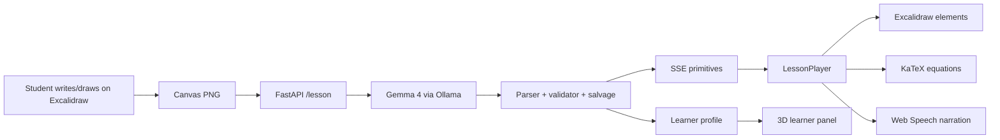

# Y: an AI learning companion that writes on your whiteboard

Submission for the [Gemma 4 Good Hackathon](https://www.kaggle.com/competitions/gemma-4-good-hackathon).

## Project Description

Y is a local-first AI learning companion built around a simple belief: the next generation of education should not be another chat box.

Students do not always think in text. They write half-solved equations, draw triangles, sketch force diagrams, circle confusing steps, and point to the part they do not understand. Y makes that whiteboard the interface. A learner writes or draws a question on an Excalidraw canvas, marks the unknown with `?`, and the system reads the board with Gemma 4, reasons about the student's intent, then writes the explanation back on the same canvas.

The response is not a generated image. It is a streamed whiteboard lesson: a title appears, captions are written line by line, equations render as clean math, arrows and boxes form diagrams, and the browser narrates the explanation aloud. The experience is closer to watching a teacher solve the problem beside you than receiving a paragraph from a chatbot.

The longer-term vision is an AI companion that grows with the learner. It should understand not only the current question, but also what the learner already knows, where they are struggling, and which representation will help next: words, equations, diagrams, flowcharts, or hand-drawn visual structure. This hackathon build is the first working slice of that vision: a Gemma-powered whiteboard tutor with local inference, sequential drawing, robust primitive rendering, educator notes, and a learner-knowledge visualization.

## Why this matters

AI has moved quickly, but learning interfaces have barely changed. Most AI tutors still ask students to type a polished prompt into a chat window. That excludes the messy, visual, unfinished way real learning happens.

Y starts from a different assumption: the canvas is the conversation.

This matters especially for STEM. A student learning Newton's laws, vector addition, binary search, molecular structures, geometry, or systems engineering often needs to see the idea unfold spatially. A good teacher does not only say the answer. They write, draw, pause, connect pieces, and choose the next representation based on the learner's confusion.

Y brings that interaction pattern to an AI system while keeping the default path local-first. The whiteboard image goes to a local Gemma 4 model through Ollama. The learner profile is a JSON file on the device. The embedding model is local. Cloud inference is optional, not required.

## What we built

### 1. A whiteboard-native tutor

The frontend is built on Excalidraw. The student can use drawing tools directly, insert sample problems, or write a custom question. When they press **Solve**, the app exports the canvas as a PNG and sends it to the backend.

The backend asks Gemma 4 to read the canvas and produce a teaching plan as a stream of primitive tags. The frontend consumes those tags over Server-Sent Events and turns each one into a drawn Excalidraw element.

The important design constraint is sequentiality. Y does not paste a final answer. It teaches step by step.

### 2. A small primitive language instead of free-form SVG

Small multimodal models are powerful but not perfectly reliable at arbitrary drawing code. So the production path uses a compact whiteboard primitive protocol:

| Primitive | Role |
| --- | --- |
| `title` | lesson heading |
| `text` | narrated caption written on the board |
| `equation` | KaTeX-rendered math |
| `box` | labelled rectangle |
| `node` | labelled circle |
| `arrow` | relationship between boxes/nodes |
| `line` | vector or free segment |

This split is deliberate. Gemma reasons about the student's problem and chooses the teaching sequence. The deterministic renderer handles layout, drawing, and animation. That gives us a cheap, fast, repairable system today, while leaving room for a future SVG-native model to replace pieces of the renderer later.

### 3. Robust parsing and repair

The model is local and small, so the backend assumes imperfect output. Instead of failing when Gemma drifts, the parser and validator repair common mistakes:

* aliases like `heading`, `formula`, and `eq` are mapped to canonical tags;
* unquoted equations such as `[equation: F=ma]` are salvaged;
* bare headers like `[Title] Newton's Law` become valid primitives;
* `[text: "a = F / m"]` is auto-promoted to an equation;
* if Gemma falls into OCR/JSON mode, `salvage.py` extracts `text_content` and synthesizes primitives from the raw text.

This is why the board does not stay blank when the model misbehaves. A rough lesson is better than no lesson, and the repair layer gives the frontend something drawable.

### 4. Sequential drawing and narration

The browser `LessonPlayer` queues primitives and plays them back in order. Text is revealed character by character. Equations are rendered through KaTeX and inserted as Excalidraw image elements. The Web Speech API narrates the lesson, so the board fills in while the voice explains.

This is the moment the demo is meant to communicate: AI as a teacher at a board, not a static answer generator.

### 5. Learner memory and latent learner space

After each lesson, the backend updates a local learner profile. It extracts concepts seen, mastered, and struggled with, creates a short summary, embeds the session with `nomic-embed-text`, and stores everything in `data/learners/<user_id>.json`.

The learner panel visualizes this profile in two ways:

* a 3D trajectory of session embeddings, showing how the learner moves through concept space;
* interpretable axes such as diagrammatic understanding, critical reasoning, creative transfer, algebraic fluency, and conceptual depth.

These axes are computed from extracted concepts, mastery signals, struggle signals, and primitive usage. The goal is not to claim a finished cognitive model. The goal is to demonstrate the product direction: a tutor that builds a living map of the learner instead of treating every question as a blank slate.

### 6. Educator mode

Y is not meant to replace teachers. It should give them leverage.

Teacher Mode runs an optional second Gemma call after the lesson and produces educator-facing notes: likely misconceptions, follow-up questions, prerequisites, and difficulty. A parent, teacher, or mentor can use this panel to see what to watch for while the learner interacts with the AI.

### 7. Fine-tuning path with Unsloth

The repo includes an Unsloth notebook for the next research step: making Gemma more SVG-native. We prepared sketch-to-SVG style data from ControlSketch-Part and trained LoRA variants of Gemma 4 E4B.

Artifacts:

* `QuantumTransformer/y-gemma4-svg-lora`
* `QuantumTransformer/y-gemma4-svg-lora-enhanced`

For the demo, the reliable path is the primitive renderer. The fine-tuned model work shows the direction we would take next: gradually replacing deterministic diagram primitives with learned SVG drawing where it improves expressiveness without sacrificing latency or cost.

## Architecture

Core stack:

* Next.js, React, Excalidraw, KaTeX, Web Speech API
* FastAPI, SSE, Ollama
* `gemma4:e4b` for local teaching
* `nomic-embed-text` for local learner embeddings
* Unsloth for LoRA fine-tuning experiments

## Why Gemma

Gemma is the center of the system. It acts as the visual reader, reasoning engine, lesson planner, educator-note generator, and concept extractor. The app is intentionally a harness around Gemma: as open models improve, the whiteboard experience improves without changing the product interface.

This is important for education. A learning tool for children should be cheap to run, private by default, and adaptable to local devices. Gemma through Ollama gives us that path.

## What worked

The strongest part of the project is the interaction pattern. Students write naturally on a canvas, and the system responds on the same canvas. The primitive protocol also worked better than asking the model for arbitrary SVG in the demo timeframe. It made the system repairable, streamable, and compatible with local inference.

The learner-space panel also became an important storytelling element. It shows that the project is not only about answering one question, but about building a model of the learner over time.

## Limitations

The current system is a prototype:

* the local model sometimes misreads handwriting or flips into OCR-style output;
* mathematical reasoning can be wrong and needs teacher oversight;
* layout is deterministic and practical, not as expressive as a human artist;
* the learner model is a proof of direction, not a validated cognitive model;
* the SVG-native LoRA is early research and not yet the default rendering path.

The system is designed around these limitations. It repairs model output, keeps the educator in the loop, stores learner data locally, and separates reasoning from rendering so individual pieces can improve over time.

## What comes next

With more time, the next steps are:

* collect real teacher whiteboard traces with stroke order;
* fine-tune a stronger SVG/action decoder;
* add richer primitives for axes, plots, circuits, chemistry, and geometry;
* build a teacher dashboard over multiple learner sessions;
* improve the learner model with prerequisite graphs and forgetting curves;
* add multilingual prompts for broader access.

## Closing

Y is a first attempt at an AI tutor that uses the same medium humans use when they teach hard ideas: a whiteboard. The dream is a companion that can meet any learner where they are, fill gaps in understanding, and express ideas with the right mix of words, equations, diagrams, and memory.

For this hackathon, we built the smallest working version of that dream: local Gemma 4 reading a student's board and writing back.
